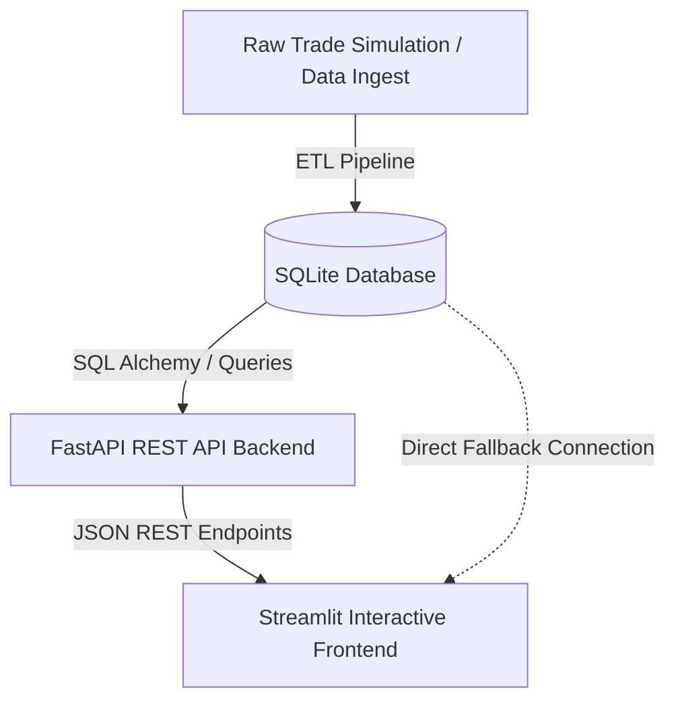

# 🚢 Port-Wise Trade Analytics Dashboard

[](https://www.python.org/)
[](https://fastapi.tiangolo.com/)
[](https://streamlit.io/)
[](https://www.sqlite.org/)
[](https://plotly.com/)
[](https://opensource.org/licenses/MIT)

A complete end-to-end full-stack data engineering and analytics platform that tracks, processes, and visualizes maritime trade operations across 10 major ports in India. The project features a robust **ETL pipeline**, a high-performance **FastAPI REST backend**, and a premium **interactive dashboard built with Streamlit and Plotly**.

---

## 🏗️ System Architecture



1. **Data Layer (ETL)**: Cleanses and structures master data into a relational database. Simulates over 5,000+ trade volume metrics (Million Tonnes) and USD valuations, factoring in real-world constraints (e.g., COVID disruptions in 2020, seasonal trends, and global price hikes like the 2022 energy crisis).
2. **API Backend (FastAPI)**: Serves analytics, geographic layout, and granular transactional data via REST endpoints. Features modular router structures, Swagger UI docs, and CORS middleware support.
3. **Visualization Frontend (Streamlit)**: Designed with a dark mode visual theme, featuring 5 dedicated explorer modes, responsive cards, geo-maps, and dual-axis chart panels. Operates with automatic resilience (switches to direct SQLite queries if the API service goes offline).

---

## 📂 Project Structure

```
port-wise-trade-analytics/
├── data/
│   └── trade_analytics.db     # SQLite Database (Auto-generated by ETL)
├── etl/
│   ├── requirements.txt       # Data processing libraries
│   └── etl_pipeline.py        # Generates schema & mocks realistic trade transactions
├── backend/
│   ├── requirements.txt       # API framework requirements
│   ├── main.py                # FastAPI server entrypoint
│   ├── database.py            # Connection managers
│   ├── schemas.py             # Pydantic schema validation models
│   └── routers/               # Modular API endpoint routers
│       ├── ports.py           
│       ├── trade.py           
│       └── analytics.py       
├── frontend/
│   ├── requirements.txt       # Streamlit & visualization libraries
│   └── app.py                 # Multi-page dashboard with dynamic data connection fallbacks
├── setup.bat                  # One-click Windows Setup Script
└── .gitignore                 # Standard repository ignores
```

---

## ⚡ Quick Start (Windows Setup)

We have provided a one-click setup script to build the virtual environment, install requirements, and run the ETL database generation.

1. **Clone & Open Project:**
   ```bash
   cd port-wise-trade-analytics
   ```

2. **Run the Setup Script:**
   Double-click `setup.bat` or run:
   ```cmd
   setup.bat
   ```
   *This creates a local `.venv`, installs all dependencies for ETL, Backend, and Frontend, and runs the ETL pipeline to generate the database.*

3. **Start the API Server (Terminal 1):**
   ```bash
   .venv\Scripts\activate
   uvicorn backend.main:app --reload --port 8000
   ```
   *Check out the interactive Swagger API Docs at `http://localhost:8000/docs`*

4. **Start the Dashboard UI (Terminal 2):**
   ```bash
   .venv\Scripts\activate
   streamlit run frontend/app.py
   ```
   *The dashboard will automatically launch at `http://localhost:8501/`*

---

## 🌐 API Reference Highlights

- **`GET /api/ports/`** - List all major Indian ports with geolocation.
- **`GET /api/ports/summary`** - Get high-level import/export tonnage metrics per port.
- **`GET /api/trade/trend`** - Dynamic trends queryable by port, commodity, or trade type.
- **`GET /api/analytics/overview`** - Global stats (KPI Cards: Total MT, USD Value, Top Port/Commodity).
- **`GET /api/analytics/top-ports`** - Rank ports by cargo throughput or USD value.

---

## 💬 LinkedIn Post Template (Ready to Share!)

Looking to post this project on LinkedIn to impress recruiters? Here is a pre-written template you can use:

```text
🚀 Thrilled to share my latest portfolio project: A Full-Stack Port-Wise Trade Analytics Dashboard! 🚢📦

I wanted to build an end-to-end data pipeline that goes beyond simple scripts and shows how modern data applications are engineered. 

Here is what went into the stack:
🔹 Data Layer (ETL): Engineered a Python ETL pipeline that generates 5,000+ realistic transaction records across 10 major Indian ports (2019-2024). The data simulates real-world events (2020 COVID disruptions, 2022 energy price shocks, and seasonal patterns) and structures them into an indexed SQLite DB.
🔹 Backend API (FastAPI): Developed a clean REST API using FastAPI and Pydantic schemas. It delivers high-speed aggregated analytics endpoints and comes fully documented with Swagger UI.
🔹 Interactive UI (Streamlit & Plotly): Created a dashboard featuring responsive KPI metrics, dual-axis trade trends, geo-maps of cargo density, and custom-sliced data exports.
🔹 Fault Resilience: Designed the Streamlit app to check for backend API status dynamically. If the API backend goes offline, it seamlessly falls back to direct SQLite querying to keep the dashboard functional!

🔗 Repo: [Insert Your GitHub Repo URL]

This project taught me a lot about building resilient, modular data architectures. I'd love to hear your feedback or suggestions!

#DataEngineering #FastAPI #Streamlit #Python #DataAnalytics #BusinessIntelligence #SoftwareEngineering #DataPipelines
```

---

## 📄 License

This project is licensed under the MIT License - see the LICENSE details.
